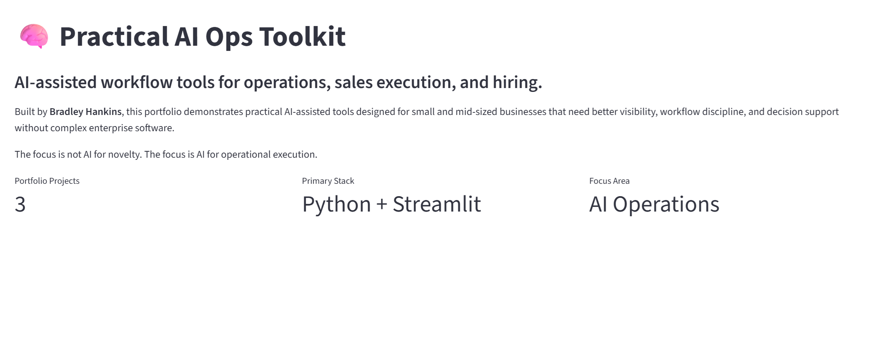
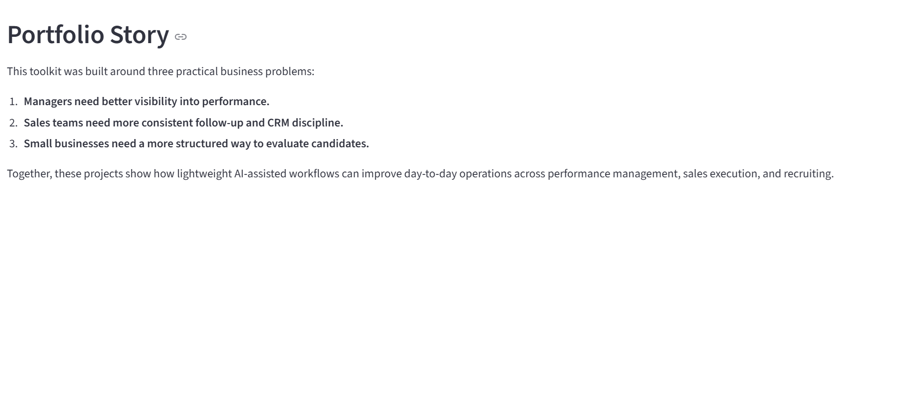
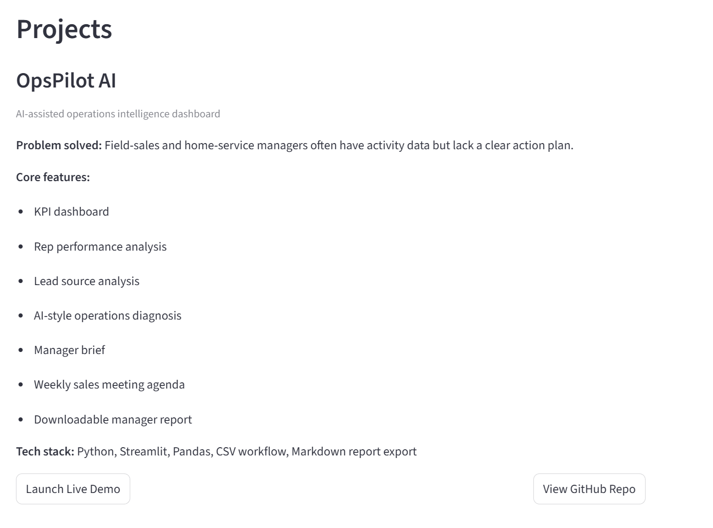
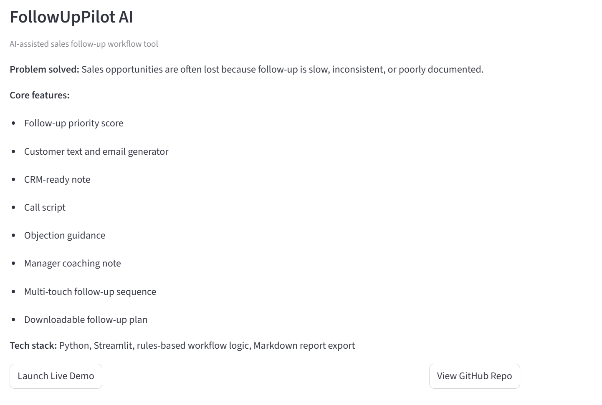
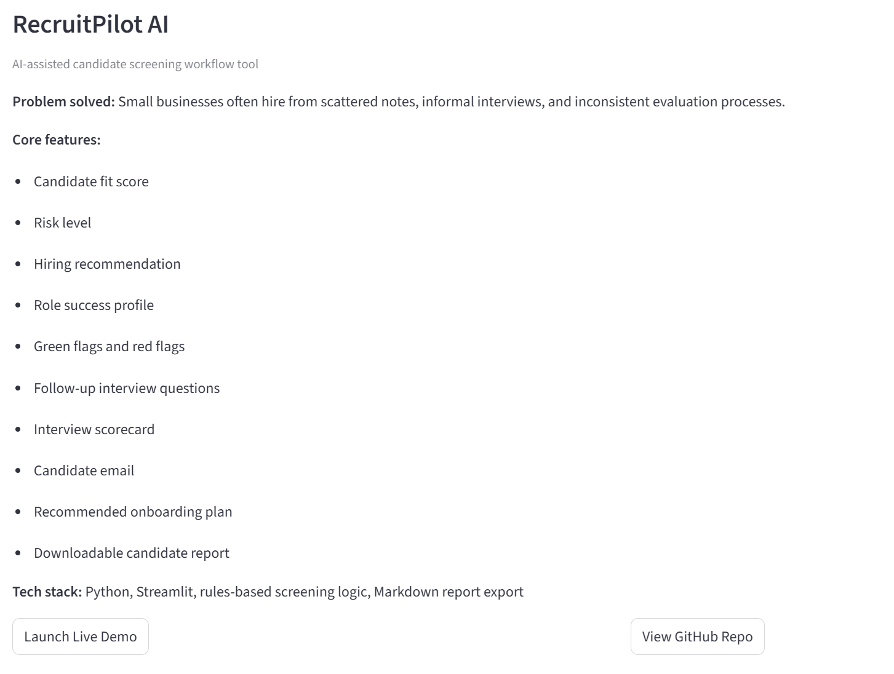
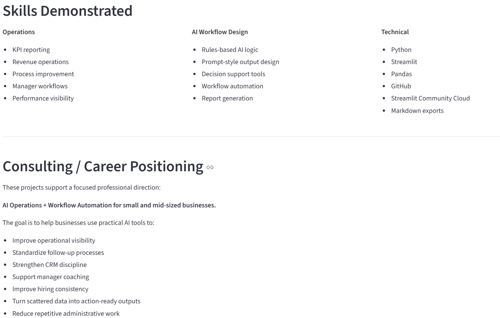

## Live Demo

[Launch Practical AI Ops Toolkit](https://ai-ops-portfolio-app.streamlit.app/)

# Practical AI Ops Toolkit

Practical AI Ops Toolkit is a portfolio hub for AI-assisted workflow tools built by Bradley Hankins.

The portfolio demonstrates practical AI applications for:

- Operations visibility
- Sales follow-up execution
- CRM workflow discipline
- Candidate screening
- Hiring consistency
- Manager decision support

## Projects Included

### OpsPilot AI

AI-assisted operations intelligence dashboard that converts field-sales activity into KPI reporting, rep performance insights, lead source analysis, AI-style diagnosis, manager briefs, weekly sales meeting agendas, and downloadable reports.

### FollowUpPilot AI

AI-assisted sales follow-up workflow tool that generates customer text messages, emails, CRM notes, call scripts, objection guidance, manager coaching notes, follow-up sequences, and downloadable follow-up plans.

### RecruitPilot AI

AI-assisted candidate screening workflow tool that generates fit scores, risk levels, green flags, red flags, follow-up interview questions, interview scorecards, manager notes, candidate emails, onboarding plans, and downloadable candidate review reports.

## Screenshots

### Portfolio Header



### Portfolio Story



### OpsPilot AI Project Card



### FollowUpPilot AI Project Card



### RecruitPilot AI Project Card



### Skills and Positioning



## Portfolio Purpose

This portfolio was created to show how lightweight AI-assisted tools can help small and mid-sized businesses improve operations without needing complex enterprise software.

The focus is practical execution:

- Better visibility
- Better follow-up
- Better hiring workflows
- Better manager documentation
- Better decision support

## Tech Stack

- Python
- Streamlit
- Pandas
- GitHub
- Streamlit Community Cloud
- Markdown report exports

## Run Locally

```bash
py -m pip install -r requirements.txt
py -m streamlit run app.py
```

## Public Demo Note

All sample data, names, companies, and scenarios used in these projects are fictional and created for public portfolio demonstration purposes.

## Built By

Bradley Hankins  
Operations & Revenue Leader | Technology & AI Workflow Integration
