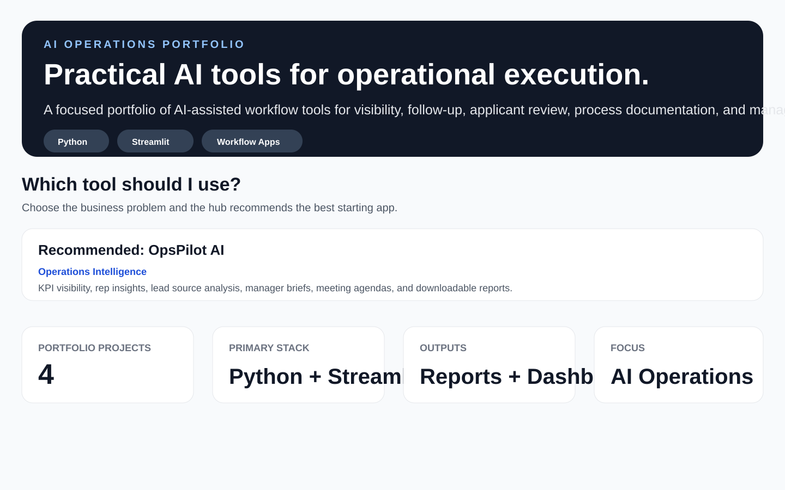

# Practical AI Ops Toolkit

Practical AI Ops Toolkit is a portfolio hub for AI-enhanced workflow tools built by Bradley Hankins.

The portfolio demonstrates practical AI applications for:

- Client workflow diagnostics
- Operations visibility
- Sales follow-up execution
- CRM workflow discipline
- ATS Lite resume review workflows
- Human-review applicant documentation
- SOP and training documentation
- Manager reporting and decision support

## Live Demo

[Launch Practical AI Ops Toolkit](https://ai-ops-portfolio-app.streamlit.app/)

## Current Version

The toolkit now uses an embedded AI pattern across the portfolio.

Each output-heavy app works in two layers:

1. **Rules-based workflow core:** provides reliable scoring, routing, diagnostics, structure, calculations, and fallback output.
2. **Embedded AI enhancement layer:** when an OpenAI token is available, the app quietly improves summaries, recommendations, reports, and communication outputs.

If the AI call fails or an API key is unavailable, the apps silently fall back to the rules-based outputs. The user experience stays the same.

## Projects Included

### ClientOps Intake AI

Client diagnostic intake assistant that identifies workflow bottlenecks, scores operational maturity, recommends automation opportunities, routes users to the right toolkit app, and generates a 30-day improvement roadmap. Includes an embedded AI-enhanced executive diagnostic summary with rules-based fallback.

### OpsPilot AI

Operations intelligence dashboard that converts field-sales activity into KPI visibility, rep performance insights, lead source analysis, operations diagnosis, manager briefs, weekly sales meeting agendas, and downloadable manager reports. Includes an embedded AI-enhanced manager brief with rules-based fallback.

### FollowUpPilot AI

Sales follow-up workflow assistant that turns customer context into next-best actions, lead temperature, deal risk scoring, customer text messages, emails, voicemail scripts, CRM notes, call scripts, objection guidance, manager coaching notes, follow-up sequences, and downloadable follow-up plans. Includes embedded AI-enhanced Copy Center outputs with rules-based fallback.

### RecruitPilot AI

Responsible ATS Lite resume review assistant that organizes job descriptions and resume text into review priorities, resume match signals, missing or unclear information, follow-up interview questions, manager summaries, candidate emails, and downloadable review packets for human review. Includes embedded AI-enhanced interview prep and manager summaries with rules-based fallback.

### SOPPilot AI

Process documentation workflow assistant that turns rough process notes into SOPs, process checklists, missing-information checks, risk diagnoses, rollout readiness guidance, manager summaries, training plans, quality control guides, implementation plans, and downloadable SOP packages. Includes an embedded AI-enhanced complete SOP package with rules-based fallback.

## Suggested Test Flow

1. Launch the live portfolio hub.
2. Review the hero section and project summary cards.
3. Use the “Which tool should I use?” section to choose a workflow.
4. Review the embedded AI-enhanced recommendation language.
5. Open each live app and generate a sample output.
6. Download a report/package from each output-heavy app.

## Screenshots

### Tool Selector and Portfolio Overview



## Export Strategy

Current exports across the output-heavy apps:

- Markdown reports/packages (`.md`) for GitHub-friendly and developer-friendly documentation
- CSV exports where structured data is useful

Planned next upgrade:

- PDF exports for manager-ready, non-technical deliverables

Markdown is useful for transparency, source control, and portfolio review. PDF will be better for end users who expect polished, shareable business documents.

## Portfolio Purpose

This portfolio was created to show how lightweight AI-enhanced tools can help small and mid-sized businesses improve operations without needing complex enterprise software.

The focus is practical execution:

- Better workflow diagnosis
- Better visibility
- Better follow-up
- Better applicant review organization
- Better process documentation
- Better training consistency
- Better manager documentation
- Better decision support

## Tech Stack

- Python
- Streamlit
- OpenAI API integration
- Rules-based workflow logic
- Silent AI fallback pattern
- Pandas
- GitHub
- Streamlit Community Cloud
- Markdown report exports
- CSV-based workflows

## Run Locally

```bash
py -m pip install -r requirements.txt
py -m streamlit run app.py
```

## Environment Variables

To enable embedded AI output:

```bash
OPENAI_TOKEN=your_api_key_here
```

The apps still work without this token by using rules-based fallback outputs.

## Public Demo Note

All sample data, names, companies, and scenarios used in these projects are fictional and created for public portfolio demonstration purposes.

## Responsible AI Note

RecruitPilot AI is designed to organize applicant information for human review. It should not be used as the sole basis for selection, rejection, compensation, or employment decisions.

## Built By

Bradley Hankins  
Operations & Revenue Leader | AI Workflow Automation | RevOps & Process Improvement
